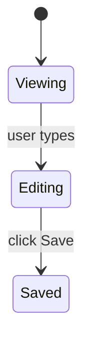

# Plan Writing Guide

Sole source of truth for plan structure, naming, content, and quality rules. Read in full at Phase 1b entry; re-read at Phase 1b exit to verify the written plan(s) against every section here.

---

## File paths + naming

### Directory layout

All plans live under `.dreamers/plans/feature-<slug>/`. Flat layouts directly under `.dreamers/plans/` are not used for new work (legacy flat files remain where they are).

```
.dreamers/plans/
├── feature-<slug>/
│   ├── manifest.md              (optional — only when multi-plan with shared context)
│   ├── plan-01-<name>.md
│   ├── plan-02-<name>.md
│   └── plan-NN-<name>.md
├── feature-<other>/
│   └── plan-01-<name>.md        (single-plan feature: no manifest)
└── archive/
    └── feature-<old>/           (archived features: whole dir moves at milestone-final PR merge)
```

### Feature directory slug rules

- Directory name: `feature-<slug>`
- Slug: lowercase, non-alphanumerics replaced by single hyphen, trim leading/trailing hyphens, collapse repeated hyphens. Empty → `misc`.

Examples: `feature-auth`, `feature-plan-format-overhaul`, `feature-checkout-flow`.

### Plan filename naming

- Filename: `plan-NN-<name>.md`
  - `NN`: zero-padded two-digit order within the feature directory (`01`–`99`).
  - `<name>`: a slug describing the plan's specific scope (NOT the whole feature).
- Lettered conventions (`plan-a`, `plan-b`) are not used.

Examples: `feature-auth/plan-01-login-flow.md`, `feature-auth/plan-02-logout.md`.

### Manifest naming

- Path: `feature-<slug>/manifest.md` (inside the feature directory, not at the plans/ root).
- Optional — produce one only when multiple plans share cross-plan context. See "Manifest pattern" below for trigger rules.

### Archive rules

When a feature's plans are all shipped (single-plan: that plan; multi-plan: all plans merged), the WHOLE feature directory moves to `.dreamers/plans/archive/`:

```
.dreamers/plans/feature-auth/  →  .dreamers/plans/archive/feature-auth/
```

Never file-by-file mid-feature. Mid-feature archive would leave partially-emptied directories.

Trigger: `/dreamers-full` Phase 3 archives the feature directory at the milestone-final PR merge.

---

## Required plan structure

### Metadata block

Top of file, just under the H1 title:

- `# Plan-NN: {short-title}` — filename matches `plan-NN-{slug}.md`.
- `**Date:**` YYYY-MM-DD
- `**Status:**` Draft / Active / Completed / Superseded
- `**Branch:**` feat/{slug} (or fix/{slug} for bug-fix plans)
- `**User-testing-required:**` yes / no

No `Owner`, no `Scope`, no `Links` metadata fields. They belong in the PR description.

### Required sections (in order, Verification LAST)

Anthropic recency-bias rule: Verification ALWAYS at the bottom of the file.

1. **Goal** (mandatory) — one paragraph. What is true when this plan is done that wasn't true before.
2. **Context** (mandatory) — ≤ 200 words. Bullet links to relevant files / prior plans / PRs. NO motivation prose ("this is important because..."); that belongs in Goal or the PR description.
3. **Acceptance Criteria** (mandatory) — XML-wrapped, numbered G/W/T with Layer annotations. See "Acceptance Criteria format" below.
4. **Out of Scope** (mandatory) — explicit bullets. "Will NOT touch X." "Will NOT change Y."
5. **Constraints** (mandatory) — XML-wrapped. Technical / process / hard rules. See "Constraints format" below.
6. **Design Decisions** (optional but recommended) — only when there are non-obvious choices. See "Design Decisions format" below.
7. **UI** (optional) — only when the plan has a user-visible surface. See "UI section" below.
8. **Verification** (mandatory, bottom of file) — commands to run + files to inspect + smoke check.

---

## Section formats

### Acceptance Criteria format

XML-wrapped, numbered, each item in Given/When/Then form with a layer annotation:

```
<acceptance_criteria>
1. Given <state>, when <trigger>, then <observable outcome>.
   *Layer: unit.*
2. Given ..., when ..., then ...
   *Layer: integration.*
</acceptance_criteria>
```

**Layer label set (closed):** `unit` / `integration` / `E2E` / `perf`. Compound labels allowed when one test serves two purposes (e.g., `*Layer: integration / perf.*`).

**Why the layer annotation:** the implementer writes failing tests from each AC; the layer label tells the implementer which test layer to write in. Probe's coverage sweep reads these labels to verify coverage at every layer.

**Number of ACs:** soft minimum 2. A plan with only one AC produces a Phase 1b self-check soft warning (overridable with user confirmation if the work is genuinely single-AC).

**"And" continuation** is allowed for compound outcomes:

```
1. Given a feature with 3 plans, when ship-strategy is "atomic", then no PR opens until all 3 plans complete; and on any plan failure, the entire feature reverts.
   *Layer: integration.*
```

### Constraints format

XML-wrapped, organized into 3 sub-categories:

```
<constraints>
- **Technical:** stack / perf / libs.
- **Process:** gates / review / tests.
- **Hard rules:** "never do Z" — the rationale-bearing constraints that prevent the agent from relaxing the rule.
</constraints>
```

### Design Decisions format (optional)

Include ONLY when the plan has non-obvious choices the implementer needs the rationale for (so the agent doesn't relax a constraint it shouldn't, and doesn't re-ask a question the planning conversation already answered).

One entry per significant choice:

- **Decision:** what was chosen
- **Rationale:** why — one sentence
- **Rejected:** alternatives considered — one line each

Skip the section entirely on trivial plans where no decision is non-obvious.

### UI section (3-layer convention)

Include this section ONLY when the plan has a user-visible surface (UI screen, CLI output, chat block, IDE pane, etc.).

**Layer 1 — ASCII layout (MANDATORY when UI section exists):**

Box-drawing characters in a code-fenced block. Shows spatial arrangement.

```
┌─ Header: title ───────────────────────────┐
│  Body content                              │
│    Nested element                          │
│  [Action button]   [Cancel]                │
└────────────────────────────────────────────┘
```

**Layer 2 — Component spec (MANDATORY when UI section exists):**

Two acceptable formats — writer's choice based on row count and cell length:

Table form (good for ≤ 5 components, short cells):

| Component | Type | Behavior | Source data |
|---|---|---|---|
| ... | ... | ... | ... |

OR per-component subsections (good when behavior descriptions are long):

```
### ComponentName
- **Type:** <UI primitive>
- **Behavior:** <what it does, when it's disabled, etc.>
- **Source data:** <where the data comes from>
```

**Layer 3 — Mermaid state/flow (OPTIONAL):**

Use only when the UI has interactive state transitions or branching flows that prose would describe verbosely.



Layer 4 (pseudo-JSX) is NOT used. Sage's research flagged it as risky — agents treat it as ground truth and over-fit.

### Verification format

Plain markdown (NOT XML-wrapped). 5–8 lines max in narrative form; code-fenced verification commands may exceed slightly. Commands and files, not narrative.

- **Test command:** the command from `CLAUDE.md`
- **Type-check command:** the command from `CLAUDE.md`
- **Files to inspect after implementation:** absolute or repo-relative paths
- **Smoke check:** one or two specific commands or manual steps not covered by automated tests

NO retelling of ACs. ACs are already specified above; Verification is the closing checklist of commands to run.

---

## Universal rules

### XML escaping rule

Inside `<acceptance_criteria>` and `<constraints>` blocks, if you need to write literal angle brackets in content (e.g., a constraint that describes another plan's XML structure), use HTML entity escapes:

- `&lt;` for `<`
- `&gt;` for `>`
- `&amp;` for `&`

Renderers (GitHub, VS Code preview) decode these to literal characters in the display. The Phase 1b parser is entity-aware — it sees `&lt;/acceptance_criteria&gt;` as text content, not a closing tag.

Self-check only flags genuinely-malformed structural XML (e.g., missing closing tag at the right nesting depth), not literal text content that happens to contain `<` or `>`.

### Code in plans (mandatory rule)

Plans must NOT include code snippets. Implementation is the implementer's domain.

**One exception:** interface and type contracts where the signature itself IS the design decision (e.g., a new public API shape). In this case:
- Include the interface/type signature only — no implementation bodies.
- State the file path and package where it will live.
- Keep it minimal: the contract, not the code.

### Plan length

- **Target:** 200–400 lines.
- **Hard cap:** 600 lines. If a plan exceeds 600 lines, split it into two plans within the feature directory.

Research evidence shows execution accuracy degrades past 600 lines for LLM consumers; technical-writing literature shows human readers disengage past ~400.

### Sections NOT to include in a plan

The following are explicitly out — do not add them to plans even if you think they'd help. Each item lists where the equivalent information goes instead.

- **Summary** — write a **Goal** paragraph instead.
- **Scope / Non-goals** — split across **Context** (bullet links to relevant code) and **Out of Scope** (explicit "will NOT" bullets).
- **Test Cases** as a standalone section — embed in **Acceptance Criteria** as `*Layer: ...*` annotations on each AC.
- **Rollback Boundary** — write in PR description / commit body. Not a plan section.
- **Risks / Mitigations** — write real risks as hard rules inside **Constraints** ("never do Z"). Decorative risk enumeration adds no execution value.
- **Post-merge gates** — write in PR description.
- **Deferred Items** — write in PR description.
- **Owner / Stakeholders / Links** metadata — write in PR description.
- **Open Questions** — banned. All open questions must be resolved in the planning conversation BEFORE plan generation. A plan with open questions is not ready to ship.
- **Race conditions sub-table** — write into Constraints when relevant.

---

## Multi-plan work

Default to one plan inside a feature directory. Split into multiple plans only when one plan's scope is genuinely too large to land cleanly in a single cycle.

### What counts as "too large"

- More than ~300 lines of new/changed code across all touched files.
- Touches more than one data-layer change PLUS more than one UI surface in the same cycle.
- Crosses natural seams (model → repository → viewmodel → screen → cloud function) in ways that make one cycle's review hard to scope.

### Splitting rules

When you do split into multiple plans, each plan MUST satisfy:

- **Independently shippable.** Each plan can be merged to main on its own. No plan depends on a later plan to land.
- **Testability in isolation.** Each plan has at least one machine-verifiable assertion the orchestrator can declare pass/fail before the next plan starts.
- **Coherent scope.** Each plan touches at most one data-layer change + one UI surface (loose guideline, not absolute).
- **Natural seam.** Split boundaries fall at model → repository → viewmodel → screen → cloud function joints, not arbitrary line-count cuts.

### Sequencing

Multiple plans within a feature directory run sequentially via:

```
/dreamers-full feature-<slug>/plan-01-<name>.md feature-<slug>/plan-02-<name>.md feature-<slug>/plan-03-<name>.md
```

OR, when a manifest exists:

```
/dreamers-full feature-<slug>/manifest.md
```

The orchestrator runs cycle-A → inline drift check → cycle-B → inline drift check → cycle-C → close-out + single PR (or per-plan PRs in INCREMENTAL ship strategy).

If plan-02 references state that plan-01 modified (paths, signatures, data shapes), the inline drift check between cycles surfaces any mismatch before cycle-02 starts.

### When NOT to split

Truly atomic changes (a single model field, a single bug fix, a single screen tweak) stay as one plan inside a single-plan feature directory. Splitting an atomic change adds ceremony without benefit.

---

## Manifest pattern (optional, for multi-plan with shared context)

When multiple plans share genuine cross-plan context — constraints, design decisions, data models, or end-to-end ACs that span all plans — produce a **manifest** at the feature directory's root: `feature-<slug>/manifest.md`.

**Why:** research on AI coding agents shows hierarchical task decomposition is significantly more effective than flat plan lists (58% faster on complex tasks; ~2× success rate on long-horizon work in published benchmarks). The manifest carries the cross-plan context into each cycle's reviewer prompts so the AI reasons with full-feature awareness, not just the single plan in isolation.

### Produce a manifest if ANY hold

- ≥ 2 shared constraints apply across all plans.
- Shared design decisions span plans (e.g., a common abstraction every plan uses).
- Shared data models / interface contracts referenced by multiple plans.
- End-to-end ACs only verifiable after ALL plans ship.
- Cross-plan rollback rules — captured as hard rules inside Shared constraints, not in a separate rollback section.

### Skip the manifest if

The multiple plans are independent (e.g., 3 unrelated changes shipped together). A manifest with all sections empty is decorative — either populate it or skip it.

### Manifest backfill (mandatory)

A feature directory may start with a single plan and no manifest. When a SECOND plan is added to the same feature directory (because work grew beyond one plan's scope), the manifest is created during the planning conversation that produces plan-02:

- **Trigger:** the planning conversation detects: feature dir already exists, contains `plan-01-*.md`, no `manifest.md` present, and the current conversation is producing what will become `plan-02-*.md` for the same feature.
- **Responsibility:** the orchestrator creates `manifest.md` in the same Phase 1b that produces plan-02. Uses the existing plan-01 as seed context for the manifest's shared sections.
- **Timing:** before plan-02 implementation starts.

This avoids the edge case where a feature has multiple plans but no manifest, and reviewer agents can't see the cross-plan shared context.

### Invocation

- Variadic plans (no manifest): `/dreamers-full feature-<slug>/plan-01-<name>.md feature-<slug>/plan-02-<name>.md ...` — plans run in argument order; no shared context.
- Manifest mode: `/dreamers-full feature-<slug>/manifest.md` — orchestrator reads the manifest, extracts the plan sequence, threads shared context into reviewer prompts at each cycle.

---

## Ship strategy heuristics

When `/dreamers-full` runs ≥ 2 plans, it presents a **Phase 1.5 ship-strategy gate** asking how to ship:

- **INCREMENTAL** — each plan's cycle ends with its own push + PR; main advances incrementally; the final plan's close-out runs the milestone retro + improvements + plan-archive.
- **ATOMIC** — plans land as commits on one branch; ONE close-out + ONE PR at the end covering all plans; whole feature dir moves to archive after the single PR merges. No per-cycle prompt — the strategy commitment at Phase 1.5 is sufficient sign-off.

The orchestrator RECOMMENDS a strategy based on heuristics; the user picks at the gate. Single-plan invocations skip this gate.

### Recommend INCREMENTAL when ANY hold

- ≥ 4 plans in the sequence (review burden of one big PR is high).
- Plans touch significantly different file subsystems (low overlap in plan Context file lists).
- Manifest's shared constraints do NOT mention "ordering dependency," "breaking change," or "coordinated revert."
- Plans are substantial (≥ 5 ACs each, or test cases spanning multiple layers).
- Plan A's value is observable to users without plans B+ (incremental value delivery).

### Recommend ATOMIC when ANY hold

- 2–3 plans only (small feature).
- Plans touch overlapping files (same files edited by multiple plans).
- Manifest's shared constraints mention "ordering dependency," "breaking change requiring shim," or "coordinated revert."
- DB migrations or schema changes gated on prior plans.
- End-to-end ACs require ALL plans to verify (no piecewise testability).
- Feature-flag protected work where partial deployment leaves the system in a half-state.

### Strategy is a runtime decision, not a manifest field

The manifest itself does NOT declare a strategy. The decision happens at invocation time, at the Phase 1.5 gate, where the user can weigh current capacity, review bandwidth, and post-incident risk against the recommendation. Same manifest may ship atomically one cycle and incrementally the next.

If signals conflict, default to ATOMIC (safer) and cite the conflicting signals.

---

## Citation accuracy (mandatory)

Before citing the behavior, structure, content, or API of any existing artifact in a plan — test file, test class, test method, Maestro YAML, assertion pattern, flow behavior, repository method, ViewModel property, or any other code artifact — **read and verify the source**.

Claiming "flow 11 uses X" or "TestClass asserts Y" without reading the file is a planning error. The plan becomes a liability when the orchestrator implements against a wrong assumption.

**Rule:** Every cited artifact must be verified by reading its source during the session in which the citation is written. If the artifact cannot be read (e.g., it does not yet exist because it belongs to a later plan in the same sequence), state explicitly that the citation is an assumption pending verification — do not present it as confirmed fact.

### Maestro assertNotVisible collision check (project-specific)

When specifying `assertNotVisible` (or `assertVisible`) text in a plan's Maestro flow requirements, **read the target screen's Compose code** and verify that no OTHER persistent UI element (filter tabs, headers, navigation labels, bottom bar items) shares the assertion text. If a collision exists, the plan must specify a more-specific assertion string that matches only the intended element.

Example: asserting `"Overdue"` is not visible will false-match if the screen has a permanent "Overdue" filter tab. The card indicator format is `"Overdue by Xh Ym"`, so the correct assertion is `assertNotVisible: "Overdue by"`.

---

## Backward compatibility

None. The format defined here applies to all plans written from the moment this guide ships. Existing flat plans in `.dreamers/plans/` (e.g., `plan-tdd-rewrite-a.md`) remain where they are; they are not auto-migrated. If you need to edit one, you may either rewrite it into the new format manually or leave it as legacy.
