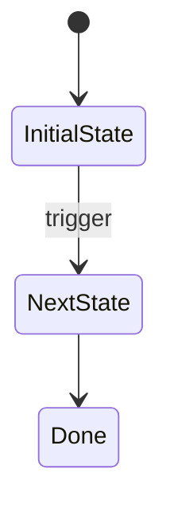

# Plan-NN: [short title]

**Date:** YYYY-MM-DD
**Status:** Draft
**Branch:** feat/<slug>
**User-testing-required:** yes/no

---

## Goal

[One paragraph. What is true when this plan is done that wasn't true before. No motivation prose ("this is important because..."); state the goal directly.]

---

## Context

[≤ 200 words. Bullet links to relevant files / prior plans / PRs. No explanation prose — just orient the implementer to what already exists.]

- `path/to/relevant-file.ext` — one-line role
- `[Prior plan or PR](path-or-url)` — what it established that this plan builds on

---

## Acceptance Criteria

<acceptance_criteria>
1. Given [precondition], when [trigger], then [observable outcome].
   *Layer: unit.*
2. Given ..., when ..., then ...
   *Layer: integration.*
3. Given ..., when ..., then ...
   *Layer: E2E.*
</acceptance_criteria>

---

## Out of Scope

- Will NOT touch [X].
- Will NOT change [Y].
- Will NOT introduce [Z].

---

## Constraints

<constraints>
- **Technical:** [stack, perf, libraries, runtime requirements]
- **Process:** [gates, review requirements, test commands]
- **Hard rules:** [things the implementation must NEVER do, with the rationale that prevents the agent from relaxing the rule]
</constraints>

---

## Design Decisions  (optional — include only if there are non-obvious choices)

**Decision:** [what was chosen]
**Rationale:** [why — one sentence]
**Rejected:** [alternatives considered — one line each]

[Add more entries as needed. Omit this section entirely on trivial plans.]

---

## UI  (only if this plan has a user-visible surface)

**Layer 1 — ASCII layout** (mandatory when UI section exists):

```
┌─ [Component / screen / panel name] ──────────────────┐
│  [Header / title row]                                 │
│                                                       │
│  [Body content — describe spatial arrangement here]   │
│                                                       │
│  [Footer / action row]                                │
└───────────────────────────────────────────────────────┘
```

**Layer 2 — Component spec** (mandatory; pick ONE format):

Table form (good for ≤ 5 components, short cells):

| Component | Type | Behavior | Source data |
|---|---|---|---|
| [Name] | [UI primitive] | [what it does + disabled rules] | [data source] |

OR per-component subsections (good when behavior descriptions are long):

### [ComponentName]
- **Type:** [UI primitive]
- **Behavior:** [what it does, when it's disabled, error states, loading states]
- **Source data:** [where the data comes from]

**Layer 3 — Mermaid state/flow** (optional, only if interactive):



---

## Verification

- **Test command:** [command from `CLAUDE.md`]
- **Type-check command:** [command from `CLAUDE.md`]
- **Files to inspect after implementation:** [list specific paths]
- **Smoke check:** [one or two specific manual or automated checks not covered by the test command]
